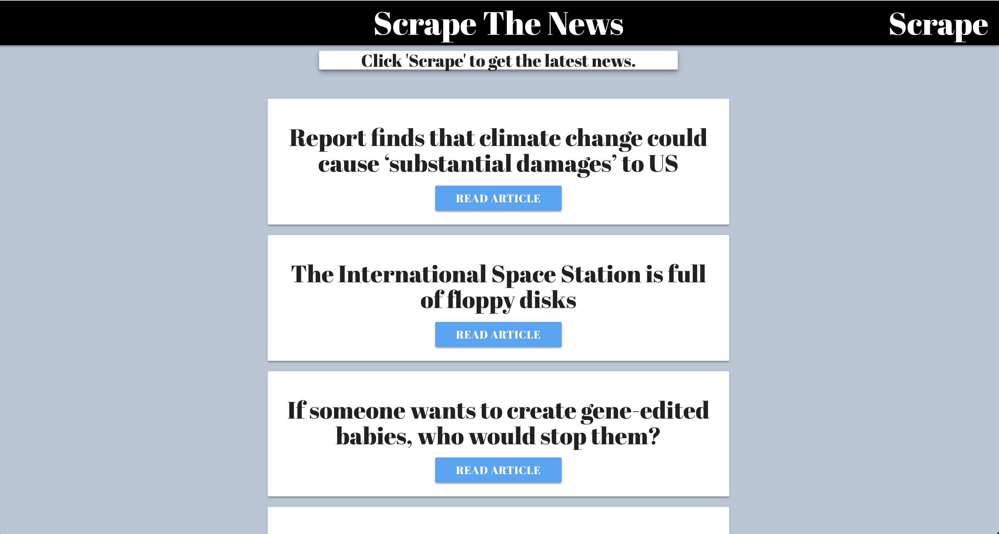
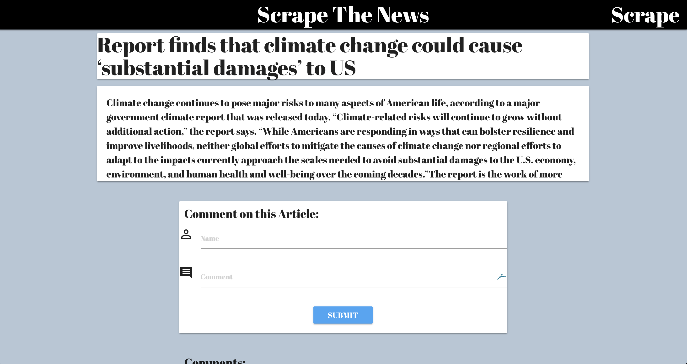

# Mongo-Scrapper

Mongo-Scrapper will let the user scrape news articles from The Verge website. When the user clicks on Scrape Article button a certain amount of articles will get displayed as a card with the following information Title, Link to the Article, "Read Article". The user can leave a comment by inputting their name and comment. 

#### Note for developers. Make sure you do "npm install" on your terminal prior to running the app. 

## Get Started
https://floating-spire-56380.herokuapp.com/

#### News articles scraped from The Verge site. 

#### Once you select the "Read Article" button, you will be able to read the full article and comment on the article.

## Dependencies/Technologies

* Node.js
* Cheerio
* MongoDB
* Express
* MongooseDB 
* Morgan

